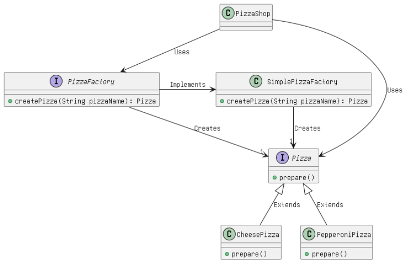

# Exploring the Factory Method Design Pattern in Java

## Introduction:
The Factory Method Design Pattern is a widely used creational pattern in Java, offering a way to create objects without specifying the exact class of object that will be created. This pattern promotes loose coupling between the client code and the object creation process. In this blog, we'll delve into the Factory Method Design Pattern, starting with its definition and then proceeding to its implementation, use cases, advantages, disadvantages, and real-world examples within Java libraries.

## Definition:

The Factory Method Design Pattern is a creational pattern that provides an interface for creating objects but allows subclasses to alter the type of objects that will be created. In other words, it defines an interface (or an abstract class) with a method for creating objects. The concrete subclasses then implement this method to produce objects of their choosing.

## Explanation in Simple Terms:

Imagine you run a pizzeria, and you have various types of pizzas to prepare for e.g Cheese pizza, Pepperoni pizza etc. Instead of letting customers specify the exact pizza they want and how it should be made, you provide them with a menu (the factory) that lists the available pizza options. When they order a pizza, you don't need to know all the details; you just ask the factory to make it for you. This way, you keep the pizza-making process hidden from the customers and allow flexibility in creating different types of pizzas.

## Class Diagram:



In the above class diagram, we create different pizza types using the Pizza interface. Then, the PizzaFactory class will create different pizza objects (e.g., Cheese or Pepperoni) based on user input.

## Implementation:

Let's dive into the implementation of the Factory Method Design Pattern using a pizza ordering system. We'll create a hierarchy of classes to represent different types of pizzas and a PizzaFactory interface for creating pizzas.


#### Step 1: Define the Pizza Interface and Concrete Pizza Classes

```java
// Create Interface Pizza.java
public interface Pizza {
    void prepare();
}

// CheesePizza.java inherits Parent class Pizza
public class CheesePizza implements Pizza {
    // Implementation of methods for creating a cheese pizza
    @Override
    public void prepare(){
        System.out.println("Preparing Cheese Pizza!!");
    }
}

// PepperoniPizza.java inherits Parent class Pizza
public class PepperoniPizza implements Pizza {
    // Implementation of methods for creating a pepperoni pizza
        @Override
    public void prepare(){
        System.out.println("Preparing Pepperoni Pizza!!");
}
```

#### Step 2: Create the PizzaFactory Interface and Concrete PizzaFactory Classes

Creating a PizzaFactory interface which will create the respective pizza based on user input.

```java
// PizzaFactory.java
public interface PizzaFactory {
    Pizza createPizza(String pizzaName);
}

// SimplePizzaFactory.java
public class SimplePizzaFactory implements PizzaFactory {
    public Pizza createPizza(String pizzaName) {
        Pizza pizza = null;

        // Create the respective pizza based on the pizzaName
        if (pizzaName.equals("cheese")) {
            pizza = new CheesePizza();
        } else if (pizzaName.equals("pepperoni")) {
            pizza = new PepperoniPizza();
        }
        
        return pizza;
    }
}

```

#### Step 3: Client Code

```java
public class PizzaShop {
    public static void main(String[] args) {
        PizzaFactory factory = new SimplePizzaFactory();
        
        Pizza cheesePizza = factory.createPizza("cheese");
        cheesePizza.prepare();
 
        
        Pizza pepperoniPizza = factory.createPizza("pepperoni");
        pepperoniPizza.prepare();
}
```

#### Program Output

```
Preparing Cheese Pizza!!
Preparing Pepperoni Pizza!!
```

#### When to Use the Design Pattern:
Use the Factory Method Design Pattern when:

* You want to delegate the responsibility of creating objects to subclasses or different components.
* You need to provide a consistent interface for creating objects, allowing for easy extensibility.
* You want to decouple client code from the specific classes it instantiates.

#### Real-World Scenarios in Java Libraries:
Several Java libraries and frameworks utilize the Factory Method Design Pattern, such as:

* java.util.Calendar: The getInstance() method creates instances of calendar objects based on the locale and timezone.
* java.nio.charset.Charset: The forName(String charsetName) method returns a Charset object based on the provided charset name.

#### SOLID Principles:
The Factory Method Design Pattern follows the followinng SOLID principles :

* Single Responsibility Principle (SRP): It separates the responsibility of creating objects from the client code, ensuring that each class has a single reason to change.

* Open/Closed Principle (OCP): The pattern allows for easy extension by adding new subclasses (e.g., new pizza types) without modifying existing code.

#### Advantages:
* Flexibility: It provides flexibility to create objects without specifying their concrete classes, making it easy to introduce new object types.
* Encapsulation: Client code is decoupled from the details of object creation, promoting encapsulation.
* Extensibility: Adding new product types (e.g., pizza flavors) is straightforward by creating new factory subclasses.

#### Disadvantages:
* Complexity: Introducing the pattern can add complexity to the codebase, especially when there are multiple factories and products.
* Increased Code: It may require the creation of multiple factory classes and additional code compared to direct instantiation.
* Overhead: In simple cases, the pattern might introduce unnecessary overhead.

#### Conclusion:
The Factory Method Design Pattern is a valuable tool in Java development, promoting loose coupling, extensibility, and encapsulation. It allows you to create objects in a flexible and maintainable way, making it a powerful choice for managing object creation in your applications. Understanding when and how to apply this pattern will help you write more modular and maintainable code.


